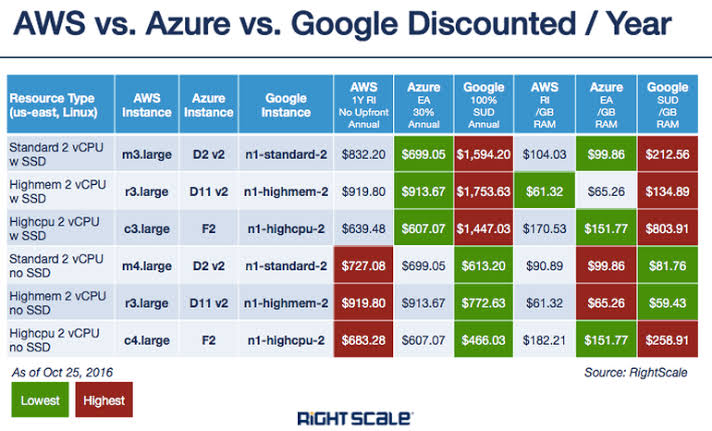
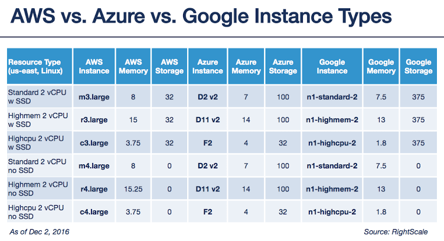
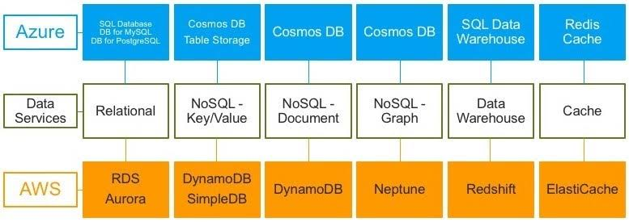
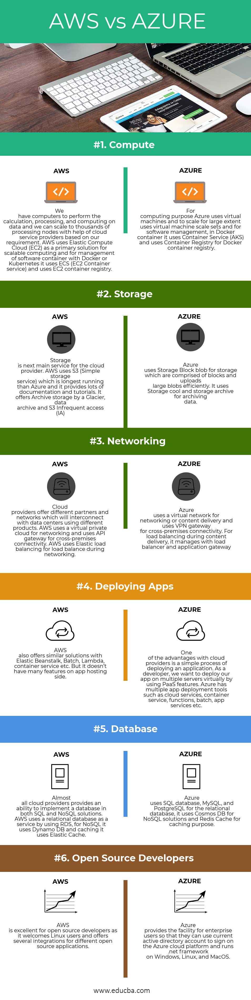
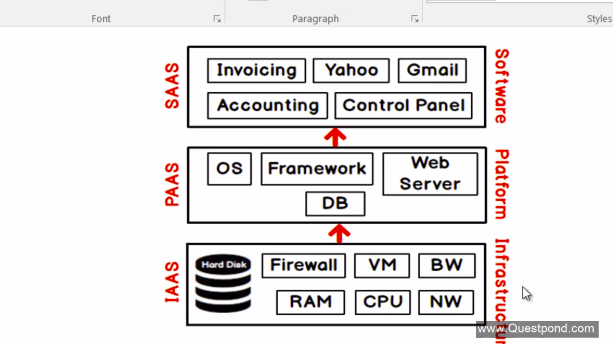

# Azure

Microsoft Azure is a cloud computing service created by Microsoft for building, testing, deploying, and managing applications and services through Microsoft-managed data centers.

[Free azure cloud website and sql db hosting](https://www.youtube.com/watch?v=E_U3g__9oDQ&list=PLjrjtggw2EDyXSq6iQyoa6ZFHODocSU83&index=2)

### Azure VS Aws

 

 

 

 

[know more](https://www.educba.com/aws-vs-azure/)

### Cloud computing

Cloud computing is the on-demand availability of computer system resources, especially data storage and computing power, without direct active management by the user. The term is generally used to describe data centers available to many users over the Internet.

 - [Tutorials](https://www.youtube.com/watch?v=wdUK7bCMXqs)

 - **What is IaaS?** 
   Infrastructure as a service (IaaS) is an instant computing infrastructure, provisioned and managed over the internet. It’s one of the four types of cloud services, along with software as a service (SaaS), platform as a service (PaaS), and serverless. IaaS quickly scales up and down with demand, letting you pay only for what you use. It helps you avoid the expense and complexity of buying and managing your own physical servers and other datacenter infrastructure.

   [know more](https://azure.microsoft.com/en-us/overview/what-is-iaas/)

 - **What is PaaS?** 
   Platform as a service (PaaS) is a complete development and deployment environment in the cloud, with resources that enable you to deliver everything from simple cloud-based apps to sophisticated, cloud-enabled enterprise applications. You purchase the resources you need from a cloud service provider on a pay-as-you-go basis and access them over a secure Internet connection.

   [know more](https://azure.microsoft.com/en-us/overview/what-is-paas/)

 - **What is SaaS?**
   Software as a service (SaaS) allows users to connect to and use cloud-based apps over the Internet. Common examples are email, calendaring, and office tools (such as Microsoft Office 365).

   [know more](https://azure.microsoft.com/en-us/overview/what-is-saas/)

 
