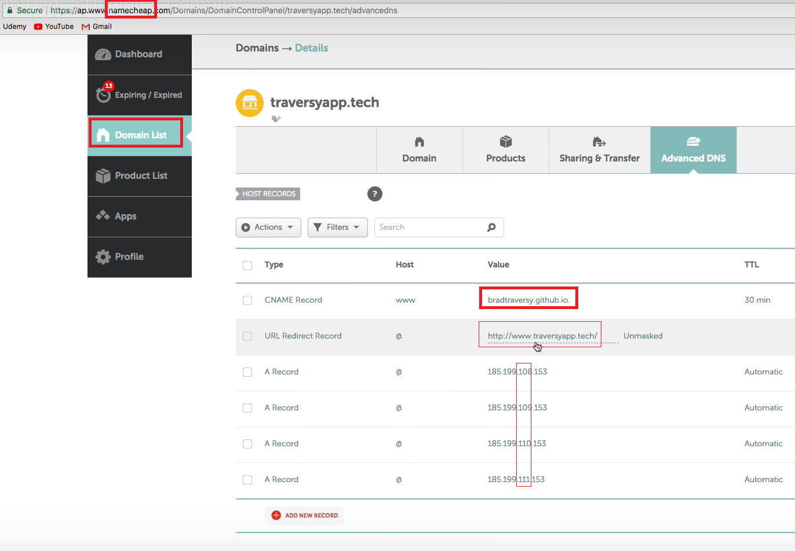

# Static website hosting on github 

 - Anything doesn't have backend (react, vanilla are also useable)
 - We will use [gh-pages](https://github.com/tschaub/gh-pages)
 - Gh-page will create a seperate branch 
 - make a folder and take all final deployment file there

## Using gh-pages

 - `npm init -y` 
 - `npm install gh-pages` 
 - in **package.json** add a homepage property below licence property (homepage property below)
 - ` "homepage":"https://MdSamsuzzohaShayon.github.io/portfolio" `
 - Create script to deploy below test property
 - ` "deploy": "gh-pages -d dist" `
 - create a git for the project and upload that to the github
 - Run this cmd "npm run deploy"

## Easy way
 - Go to setting of github project
 - github pages -> source -> Select a publishable page 

## Add custom domain
 - Purchase a domain and add some records
 - add similler ip address by increasing one
 - Example: 

 - Change cname and redirect record

 - Go to setting of github project
 - github pages -> custom domain

## Github Desktop Application

 - Download Github Desktop Application -> sign in
 - Create new repo and publish it to github
 - name: **username.github.io**
 - Copy all of my file and paste it to **username.github.io** folder
 - For creating folder first we will create path for our website and there will be **username.github.io**
 - Write something in summery
 - Publish repository