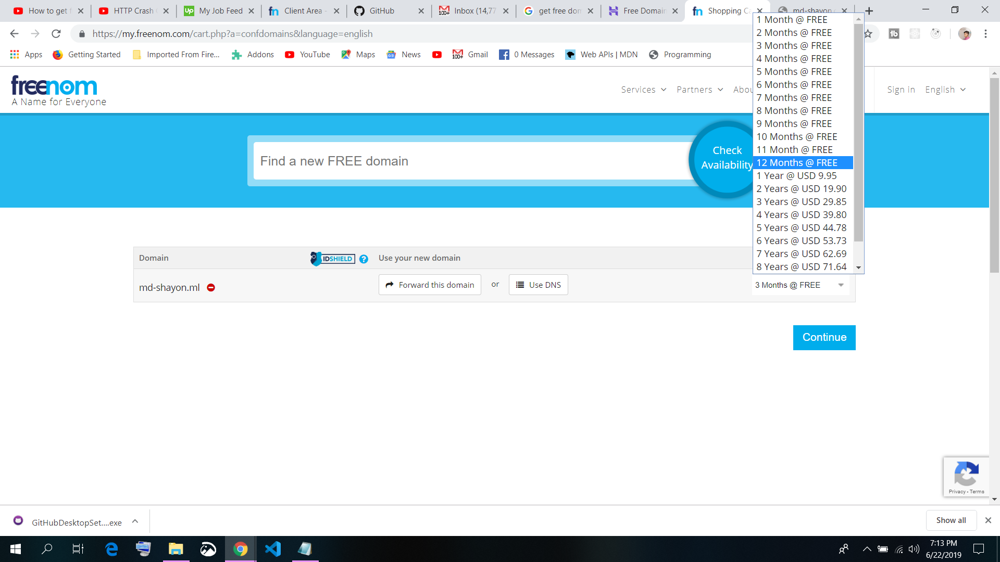
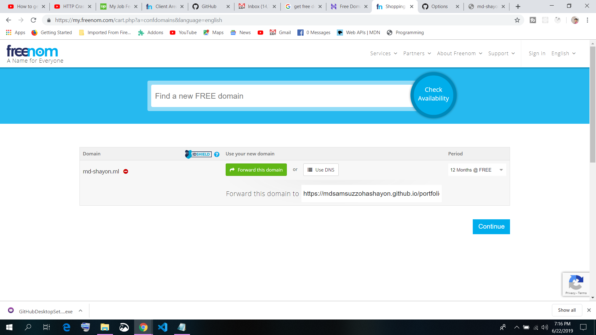

# There are some site provide free domain

## What Is the Difference Between a Paid & Free Website Domain?
A free website domain has either uncommon extensions like .tk (versus common extensions like .com) that don’t rank well and lack credibility or require a sign up for other paid services like web hosting services. Most small businesses can get a free domain name with a credible extension for a few dollars a month or for free by signing up for quality hosting services like Bluehost.

## Which Free Domain Name Is Best?
The best free domains are ones with credible extensions readers or customers trust, like .com, .org, .net, and .edu. These make your readers feel more at ease by offering a professional look that puts your website in the same class as reputable organizations’ and businesses’ websites. To get a free, credible domain name, you can purchase web hosting packages with a company like Bluehost that include a free domain name.

## Can You Buy a Domain Name Outright?
Since registering a domain name means you are leasing the name, it cannot be purchased outright. Just like renting a house, you have possession of a domain for a certain period of time. However, some providers allow you to register a domain name for anywhere from one month to 10 years before having to renew it.

## How Can You Create a Domain Name in Less Than a Minute?
This depends on your domain name provider. For Bluehost, for example, register for an account by clicking “Create account” on the homepage. Select the hosting package you’d like by clicking on the green “Select” button under your package description. From there, enter the domain name you’d like under “New Domain” and the extension you’d like (we recommend .com). Enter your contact and credit card information, then click the green “Submit” button.

 - https://freenom.com

 - https://www.hostinger.com

 - Option 1: Get a Free .com Domain With Affordable Web Hosting (Bluehost )
 - Option 2: Get a Free Website Domain for One Year Plus Site Builder (Wix)
 - Option 3: Get Free Domain Name & Limited Web Builder (Dreamhost)
 - Option 4: Get a Free Subdomain From a Website Builder (Weebly)
 - Option 5: Get a Free .Tk Domain Name (Powered by Freenom)
 - Option 6: Get a Free .Co.nf Domain Name (At Biz.nf)

