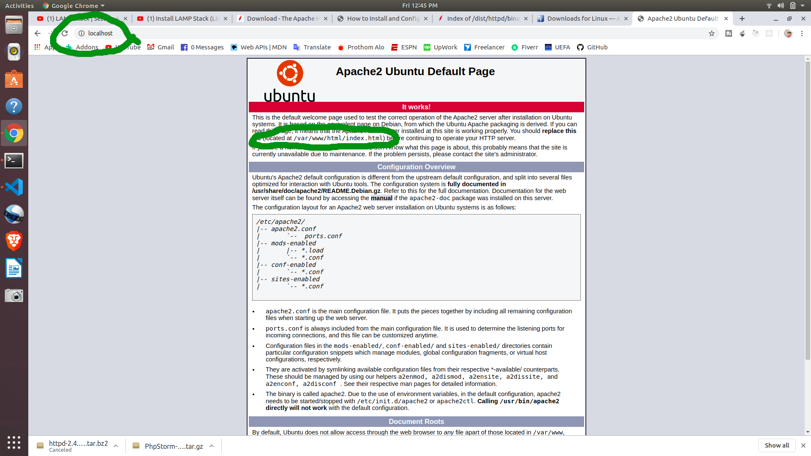
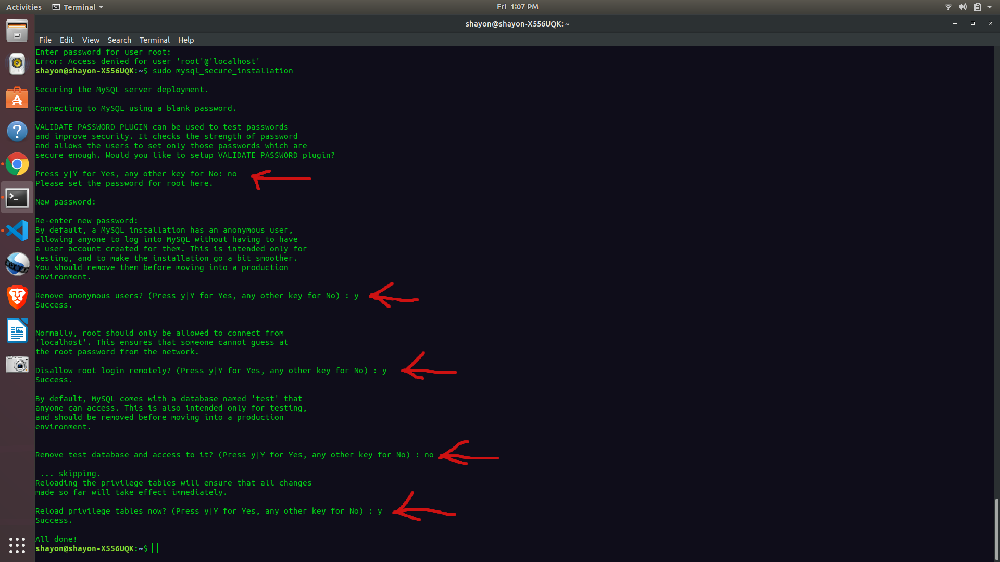
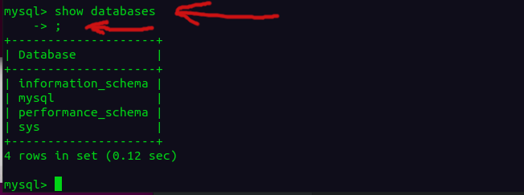

# LAMP

*Linux - Apache - MySql - Php*

[tutorial](https://www.youtube.com/watch?v=CEghFZe7ALA&t=14s)

### Apache

```
sudo apt update && sudo apt upgrade -y
sudo apt install apache2
```

[Documentation](http://httpd.apache.org/docs/)

Open **localhost** in any web browser




```
service apache2 status
service apache2 start
service apache2 stop
service apache2 restart
```

[Installation Documents](http://httpd.apache.org/docs/2.4/install.html)

### MySql

```
sudo apt install mysql-server
sudo mysql_secure_installation
```


```
service mysql status
service mysql start
service mysql stop
service mysql restart
```

Show and create DB and more

`mysql -u root -p`

password: 1234

```
show databases
;
```




[Installation documents](https://dev.mysql.com/doc/refman/8.0/en/linux-installation.html)

[Documentation](https://dev.mysql.com/doc/)


### PHP

```
sudo add-apt-repository ppa:ondrej/php
sudo apt-get update
sudo apt-get install php libapache2-mod-php php-mysql php-curl
```

change directory to http server file

```
cd /var/www/html
```
make a **index.php** file and edit with nano editor

`sudo touch index.php && sudo nano index.php`

Get php information 

```
<?php
echo phpinfo();
```

This won't work because it looks first **index.html** if **index.html** is not there it look for **index.php**

`sudo gedit /etc/apache2/mods-enabled/dir.conf`

Take **index.php** before **index.html**

`service apache2 restart`

now go to __http://localhost/__

### PhpMyAdmin

[Documantations](https://docs.phpmyadmin.net/en/latest/)

[Docs from Degitalocean](https://www.digitalocean.com/community/tutorials/how-to-install-and-secure-phpmyadmin-on-ubuntu-18-04)

```
sudo apt update
sudo apt install phpmyadmin php-mbstring php-gettext
```

`sudo nano /etc/apache2/apache2.conf`

Add a line in below of this document

`Include /etc/phpmyadmin/apache.conf`

Now Restart Apache

`sudo service apache2 restart`

Use this url __http://localhost/phpmyadmin/__

Username: root
Password: 1234


### Setup

```
cd /var/www/html/
ls -la
sudo chown shayon:shayon ./ -R
```

### Connection
By default root user is root and password is blank
Change root user password

```
sudo bash
mysql
ALTER USER 'root'@'localhost' IDENTIFIED WITH mysql_native_password BY 'NEW_PASSWORD'
```

[know more](https://docs.bitnami.com/bch/infrastructure/lamp/administration/change-reset-password/)


