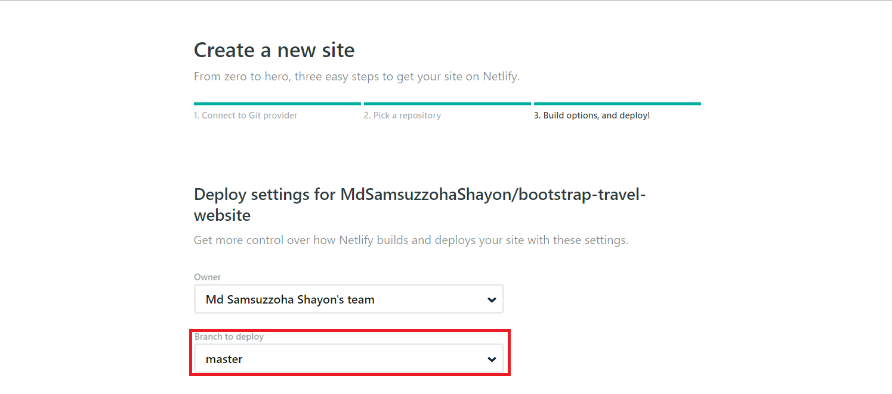

# Netlify

[Official docs](https://www.netlify.com/docs/)

## Publishing website

 - Login with github
 - new site from git
 - Continuous development -> Github -> Select repo
 - Choose branch 

 - we need publish directory when the **index.html** file is not in rootfolder
 - then we need write folder name from where main file is coming
 - <button> Deploy site </button> 
 - It will give netlify custom domain

## Using cli tool

 - [docs](https://www.netlify.com/docs/cli/#netlify-dev-beta)
 - installation netlify cli `npm install -g netlify-cli` 
 - deploying site `netlify deploy` -> Authorize
 - site id is optional
 - Path to deploy is where our main file is (we don't need to give anything if index.html is inside root folder)
