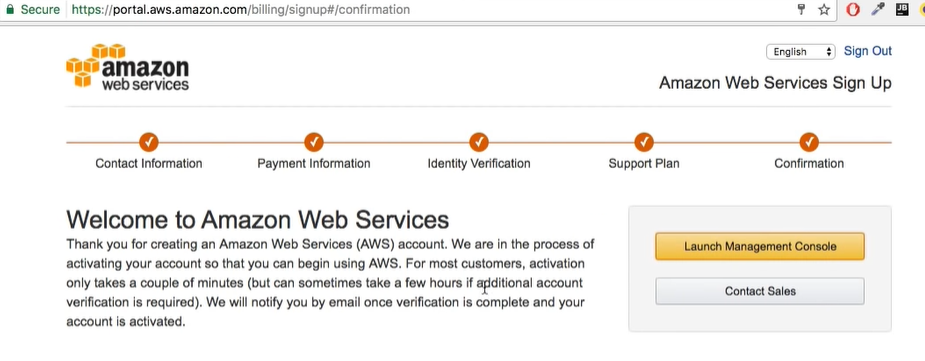
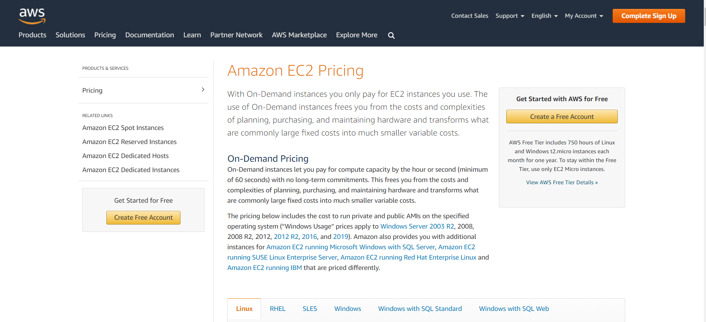
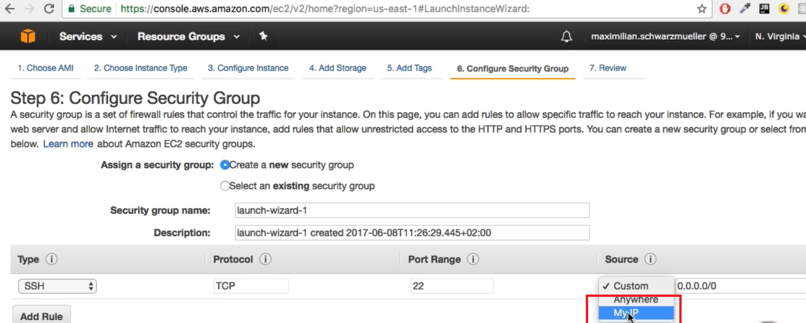

# AWS - Amazon Web Services

It's a cloud service company

[Official Website](https://aws.amazon.com/)

[Academind tutorial](https://www.youtube.com/watch?v=ubCNZRNjhyo)

 - Create a AWS account that will take credit/debit card number
 - After complete all task launch AWS management console



 - Read some solution it will make esier to use


 - go to console -> expand all services -> select anyone -> select region (from where we want to host)
 - to select region take a look at [global infrastructure](https://aws.amazon.com/about-aws/global-infrastructure/?hp=tile&tile=map)
 - Launch Instance (vartual server) -> Select amozon Linux (We can select any linux)
 - Take a look how AWS pricing [works](https://aws.amazon.com/pricing/?nc2=h_ql_pr). See free teir [boundaries](https://aws.amazon.com/free/?all-free-tier.sort-by=item.additionalFields.SortRank&all-free-tier.sort-order=asc&awsf.Free%20Tier%20Types=categories%23featured)
 - Pricing -> Optimize your cost -> Services Pricing -> See price for what service we are using
 - See on-demand pricing



 - Select linux -> see the costs
 - now back to the management console
 - click on Next to see all configurations
 - Add storage -> Add new vloume (don't let it be default)
 - Configure security group -> type ssh with my ip setup



 - Review and launch -> Create a new key pair -> give any name ->  download it and store it in a save place
 - Launch instances
 - Go back to EC2 (or any other service we are using) -> Instances (it will take some time to install )
 - Actions -> instate state -> terminate
 - go to the root page -> build a solution -> build a web app -> name -> select platform -> Application  code upload as zip
 - Configure more options -> configure presets
 - Envitonment setting -> name 
 - **Create app** -> It will create all installation for us
 - node command -> command to run our code -> for example `npm start` -> apply
 - There will be a url to show the website

### EC2
 - [Amazon Elastic Compute Cloud](https://aws.amazon.com/ec2/?ec2-whats-new.sort-by=item.additionalFields.postDateTime&ec2-whats-new.sort-order=desc) (Amazon EC2) is a web service that provides secure, resizable compute capacity in the cloud. 
 - [Deply nodejs -1](https://ourcodeworld.com/articles/read/977/how-to-deploy-a-node-js-application-on-aws-ec2-server), [Deply nodejs -2](https://mannhowie.com/aws-node#5), [Deply nodejs -3](https://www.c-sharpcorner.com/article/how-to-create-aws-ec2-instance-and-host-node-js-applications/), [Setup nodejs](https://docs.aws.amazon.com/sdk-for-javascript/v2/developer-guide/setting-up-node-on-ec2-instance.html), [aws wordflow](https://aws.amazon.com/getting-started/hands-on/deploy-nodejs-web-app/), [GitHub to AWS EC2 with CodePipeline](https://seanjziegler.com/deploying-code-from-github-to-aws-ec2-with-codepipeline/), [Pipeline aws](https://docs.aws.amazon.com/codepipeline/latest/userguide/tutorials-simple-codecommit.html), [Intregare gitbub](https://docs.aws.amazon.com/codedeploy/latest/userguide/integrations-partners-github.html), [Deply from github](https://docs.aws.amazon.com/codedeploy/latest/userguide/tutorials-github.html), [MERN Stack App to Amazon EC2](https://jasonwatmore.com/post/2019/11/18/react-nodejs-on-aws-how-to-deploy-a-mern-stack-app-to-amazon-ec2), [MERN Stack ec2](https://itnext.io/deploy-a-mongodb-expressjs-reactjs-nodejs-mern-stack-web-application-on-aws-ec2-2a0d8199a682), [MERN Stack on AWS EC2](https://keithweaverca.medium.com/setting-up-mern-stack-on-aws-ec2-6dc599be4737), [Mern stack](https://dev.to/rmiyazaki6499/deploying-a-production-ready-react-express-app-on-aws-62m), [AWS EC2 With LetsEncrypt SSL](https://betterprogramming.pub/deploy-mern-stack-app-on-aws-ec2-with-letsencrypt-ssl-8f463c01502a)

 - At first go to [aws](https://aws.amazon.com/ec2/?nc2=h_ql_prod_fs_ec2&ec2-whats-new.sort-by=item.additionalFields.postDateTime&ec2-whats-new.sort-order=desc) and launch instance AWS EC2
 - Select Ubuntu server -> Preview and launch -> Launch -> **Create a new key pair** -> name anything -> download it -> view instance
 - Check instance -> copy **public ip** from down (it may closed)
 - Use linux terminal, putty (Windows), git bash (windows) and change directory where key pair is downloaded
    ```
    # BY DEFAULT DOWNLOADS FOLDER
    cd Downloads
    # 3.121.126.96 IS THE PUBLIC IP WE COPIED
    ssh -i keyname.pem ubuntu@3.121.126.96
    # NOW WE ARE ON UBUNTU TERMINAL
    ```
 - From ubuntu terminal -> clone repo, for private repo use ssh url from github -> search for [generate ssh key](https://docs.github.com/en/github/authenticating-to-github/generating-a-new-ssh-key-and-adding-it-to-the-ssh-agent)
    ```
    # GO TO HIDDEN DIR
    cd ./ssh
    ssh-keygen -t ed25519 -C "your_email@example.com"
    # ENTER FEW TIMES KEEP IT DEFAULT
    ls -la
    # WE WIL HAVE TO FILE AS AUTHORISED KEY
    nano id_rsa.pub
    # COPY ENTIRE CONTENT OF THE KEY
    ```
 - Go to github repo -> setting -> deploy keys -> add deply key -> give a name and paste the key we copied -> now we can clone the code event it's private repo
    ```
    cd ..
    git clone git@github.com:MdSamsuzzohaShayon/repo-name.git domainname.com
    ls -la
    cd domainname.com
    ```
- [Install nodejs on our server](https://github.com/nodesource/distributions/blob/master/README.md)
    ```
    curl -fsSL https://deb.nodesource.com/setup_lts.x | sudo -E bash -
    sudo apt-get install -y nodejs
    node --version
    npm --version
    ```
 - Install all dependencies for server and client (Mern stack)
    ```
    cd client 
    npm install
    cd ..
    cd server
    npm install
    ```
### MYSQL Database
 - Connect to **database** (My Sql) -> aws console -> products -> database -> amazon RDS -> create database -> select mysql ,free tier, change name, set password, connectivity->additional->public access **yes** -> create database
 - If it's done creating -> click on the database -> in connectivity & security -> endpoint & port -> copy endpoint
 - In aws connectivity & security -> security -> click on default -> from bottom panel -> inbound rules -> edit inbound rules
 - Add rule -> MySql/Aurora, source anyware, see port range -> go to mysql shell
    ```
    # MYSQL SHELL
    # FOR WINDOWS
    \c admin@the-endpoint-we-have-copied
    # ENTER PASSWORD
    ```
 - Now we are connected to mysql -> from shell
    ```
    # MYSQL SHELL
    \sql
    show databases
    # WE DON'T HAVE OUR DB HERE
    ```
 - In our project folder create a **.env** -> setup .env in nodejs project -> **make a clone** of .env with name of .env.example(any name) -> set all credential value blank inside .env.example -> and push it to github repository - and use **cross-env** package

 - From server terminal change all the credentials or environment variables
    ```
    # SERVER TERMINAL 
    git pull
    cp .env.example .env
    nano .env
    # SET ALL THE CREDENTIAL HERE
    ```
 - Formy mysql -> change username(*admin*), password, db name, host will be the-endpoint-we-have-copied, bd dialect is mysql
 - Sequlize cli configure
    ```
    # SERVER TERMINAL 
    sudo npm install -g sequlize-cli
    sequlize db:create
    sequlize db:migrate
    sequlize db:seed:all
    ```
 - Check the database
    ```
    # FROM SQL SHELL
    show databases
    # WE CAN SEE OUR DB HERE
    use chat;
    select * from sometable;
    ```

### Nginx
 - [Install nginx](https://www.digitalocean.com/community/tutorials/how-to-install-nginx-on-ubuntu-20-04) `sudo apt install nginx -y`
 - Http access -> ec2 -> security -> click on security group -> edit inbound rules -> add rule -> type: http, source: anyware -> save rule
 - Go to ec2 -> copy public ip and paste it into browser as url -> we will get *welcome to nginx*
 - Location of nginx default page
    ```
    cd /var/www
    # HTMK DIR
    ls -la
    cd html/
    ls -la
    sudo nano index.nginx-debian.html
    # CHANGE ANYTING
    ```
 - Reload the page (public ip address)
 - Hosting react js production build with nginx - at first copy all files
    ```
    cd ~
    cd domainname.com
    # FOR REACT JS
    cd client
    npm run build
    # CREATE NEW DIRECTORY NEXT TO THE HTML DIRECTORY OF NGINX
    sudo mkdir /var/www/domainname.com
    # CHANGE PERMISSION
    sudo chown -R $USER:$USER /var/www/domainname.com
    # COPY ALL BUILD FILES TO THE NEW FOLDER NEXT TO NGINX INDEX
    cp -r build/* /var/www/domainname.com
    ls -la /var/www/domainname.com
    ```
 - Serve react js with nginx
    ```
    cd /etc/nginx/sites-available
    ls -la
    # DEFAULT FILE
    sudo nano default
    # CHANGE THE POINTED FOLDER
    root /var/www/domainname.com;
    # INSIDE LOCATION /{}
    try_files $uri /index.html;
    ```
 - Restart nginx `sudo systemctl restart nginx`
 - Go to chrome and refresh with front end -> we will get our frontend (not connected to backend)
 - Running the node js server
    ```
    cd ~
    cd domainname.com
    sudo npm install -g pm2
    pm2 start app.js --name "someservername"
    ```
 - Setting nginx reverse proxy
    ```
    sudo nano /etc/nginx/sites-available/default
    # INSIDE NANO EDITOR CREATE ONE MORE LOCATION BELOW LOCATION
    location /graphql/{
        proxy_pass http://localhost:4000/;
        proxy_http_version 1.1;
        proxy_set_header Upgrade $http_upgrade;
        proxy_set_header Connection "Ugrade";
    }
    ```
 - restart nginx `sudo systemctl restart nginx`
