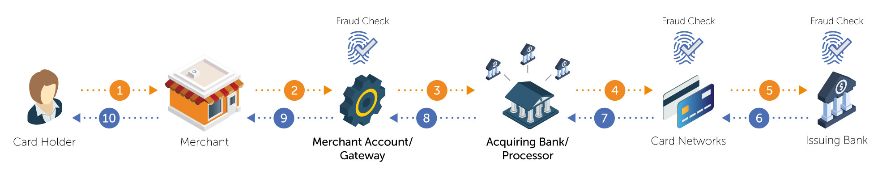
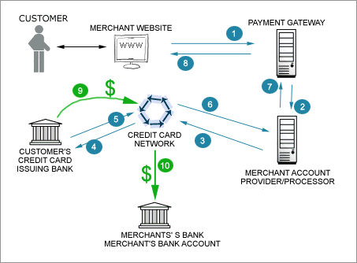
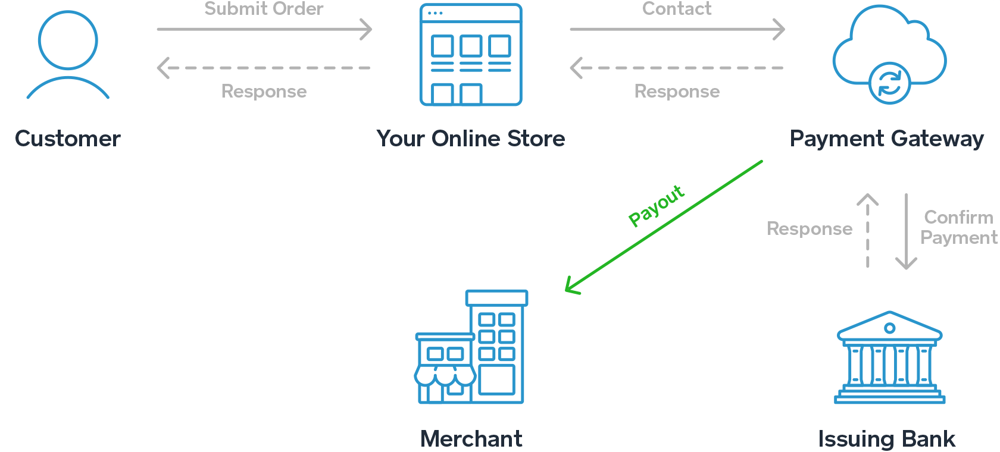
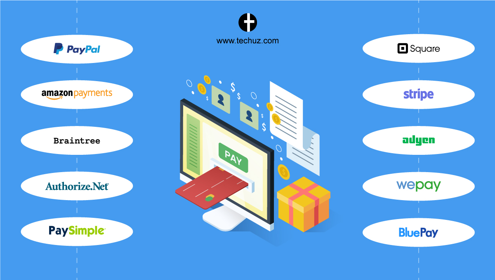
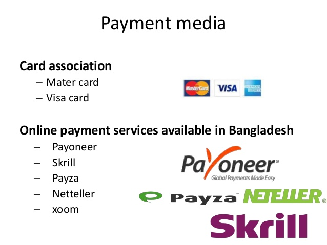

# Merchant Account

A merchant account is a type of bank account that allows businesses to accept payments by debit or credit cards. So a merchant account is an agreement between a retailer, a merchant bank and payment processor for the settlement of credit card and/or debit card transactions.

## Payment Gateway

A payment gateway is a merchant service provided by an e-commerce application service provider that authorizes credit card or direct payments processing for e-businesses, online retailers, bricks and clicks, or traditional brick and mortar.

Top payment gateways

## Payment page/form builder

 1. [wufoo](https://www.wufoo.com/). **Build and share online forms.** Create forms, collect data and payments, and automate your workflows.
 2. [simplypay.me](https://www.simplypay.me/). **COLLECT PAYMENTS ONLINE.** w/ Secure Payment Pages & Invoicing Links
 3. [formstack](https://www.formstack.com/). **Let’s revolutionize data collection. Together.** It’s time to shake up the way you capture data and put it to work. Use Formstack to reduce process chaos and forge your way to better workplace productivity.

## What is a virtual terminal? 

A virtual terminal turns your computer into a credit card terminal—it allows you to manually process payments right from a web browser. It's great for remote billing or taking credit cards over the phone.
